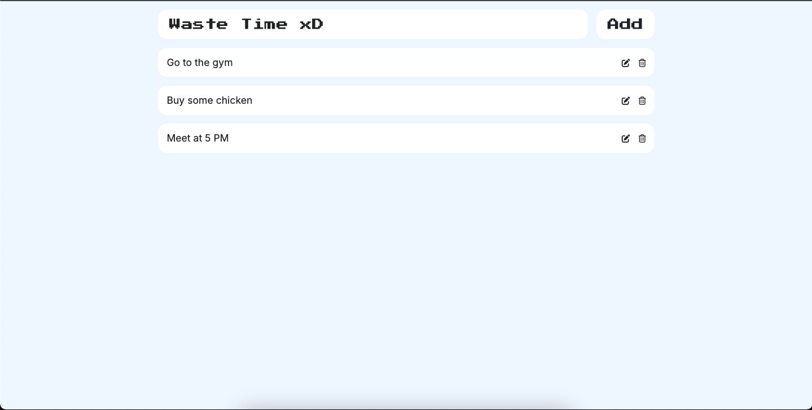

# Todo List Application

A simple Todo List application built with React.js. This application allows users to add, edit, and delete todos. Todos are stored locally using `localStorage`, so they persist across browser sessions.

 

## Features

- **Add Todos**: Enter a new todo in the input field and click "Add" or press Enter.
- **Edit Todos**: Click on a todo to edit it directly.
- **Delete Todos**: Remove a todo by clicking the delete button next to it.
- **Persistent Storage**: Todos are saved in `localStorage`, so they persist even after refreshing the page.

## Built With

- **React.js**: A JavaScript library for building user interfaces.
- **Vite**: A modern build tool that provides a faster development experience and optimized production builds.

### Installing npm packages and running the app

After cloning the repo install the required packages by running:
`npm i` or `npm install`

To run the app in dev mode:
`npm run dev`
